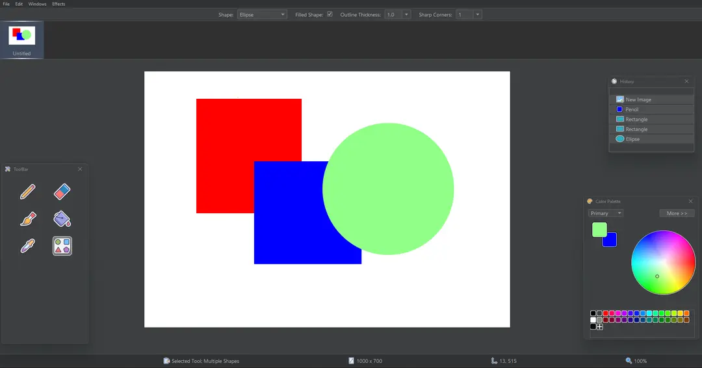
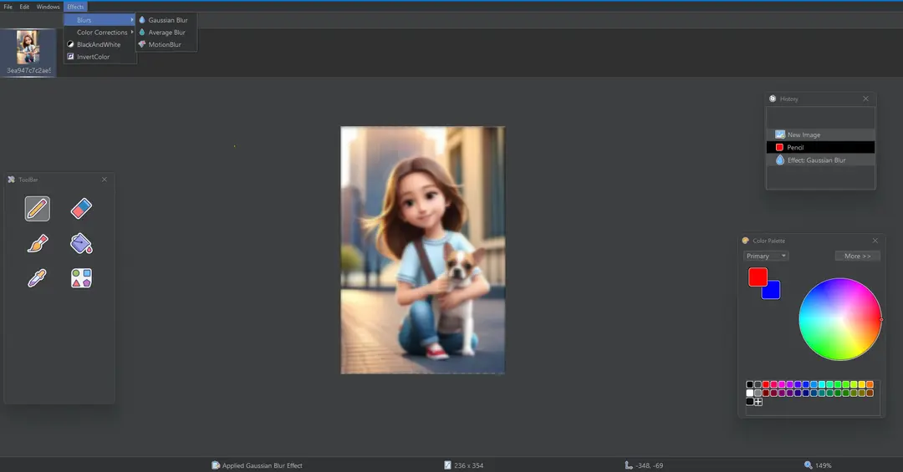

# Advanced Image Editor  

A comprehensive image editing application built in Java, designed to provide powerful tools for creating and manipulating images. The editor includes a variety of features such as drawing, cropping, resizing, filtering, and more, all wrapped in a user-friendly interface developed with Swing. This project was developed by **Mizab** and **Advaitya Jadhav**, focusing on flexibility, functionality, and ease of use.  

## Features  
- **Drawing Tools:** Freehand drawing and brush tools for creative editing.  
- **Image Manipulation:** Modify and adjust images with precision.  
- **Filters:** Apply custom filters to enhance or stylize images.  
- **Cropping Tool:** Select and crop areas of images seamlessly.  
- **Resize:** Scale images while maintaining quality.  
- **Shapes:** Add geometric shapes for design and editing.  
- **Image History:** Undo/redo functionality for non-destructive editing.  
- **File Operations:** Open and save image files with ease.  

## Tech Stack  
- **Java:** Core programming language for application development.  
- **Swing:** For building the graphical user interface (GUI).

## Images

## Contributors  
- [Mizab](https://github.com/Mizab1)
- [Advaitya Jadhav](https://github.com/AJ-316)
